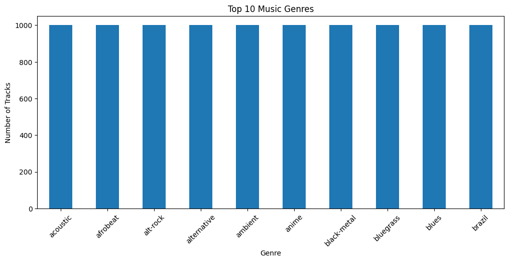
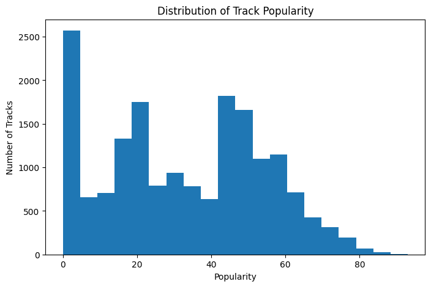
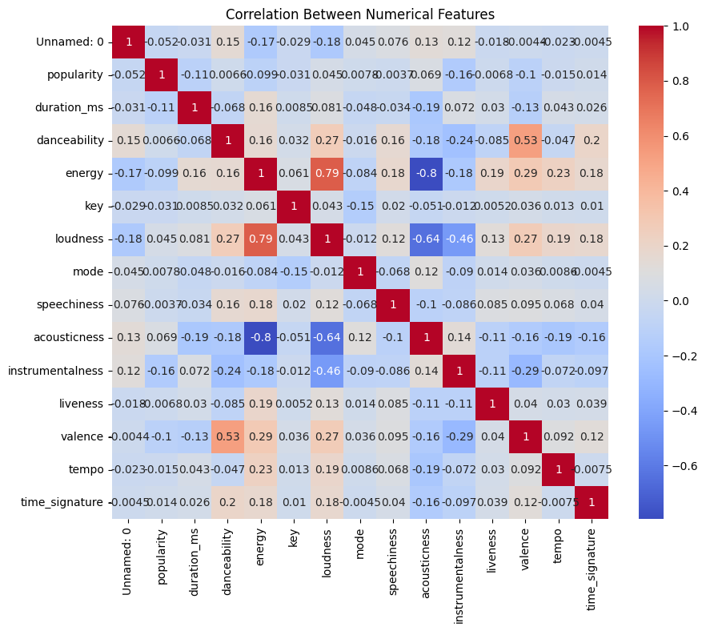
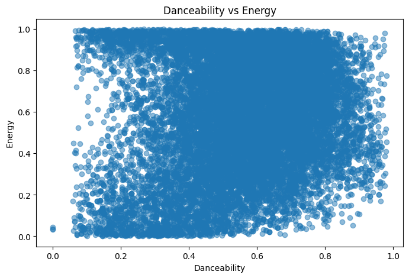
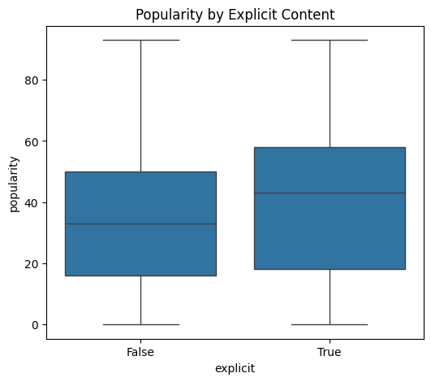
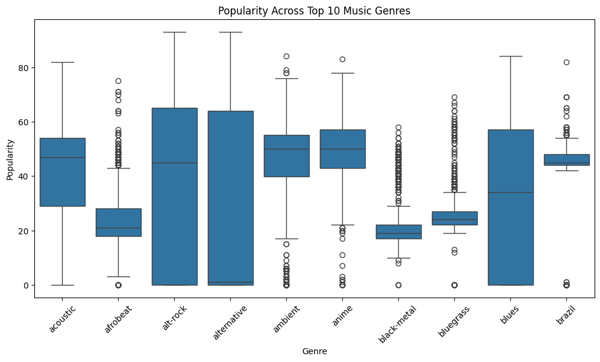

# EDA , Data Visualization & Storytelling

## Dataset Overview

This project performs Exploratory Data Analysis (EDA) and data visualization on the Spotify Tracks Dataset using Pandas, Matplotlib, and Seaborn. The goal is to understand the dataset and identify patterns through visualizations.

## Visualizations

### 1. Top 10 Music Genres

**Insight:** A few music genres contain significantly more tracks than others.

### 2. Track Popularity Distribution

**Insight:** Most tracks have moderate popularity, while only a few are highly popular.

### 3. Correlation Heatmap

**Insight:** Some numerical features, such as energy and loudness, show noticeable correlations.

### 4. Danceability vs Energy

**Insight:** Songs with higher danceability generally tend to have higher energy.

### 5. Popularity by Explicit Content

**Insight:** Explicit and non-explicit songs have similar popularity distributions.

### 6. Popularity Across Top Genres

**Insight:** Popularity varies across different music genres.

## Overall Conclusions

- The dataset contains tracks from many music genres, although a few genres dominate.
- Most songs have moderate popularity.
- Danceability and energy show a positive relationship.
- Explicit content does not significantly influence popularity.
- Data visualization helps reveal meaningful trends and relationships in Spotify track data.